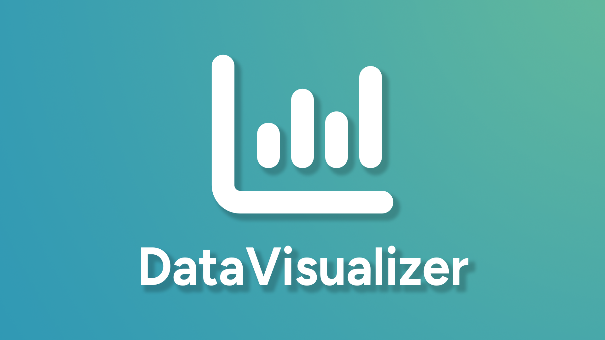

DataVisualizer is a program written in python that allows users to display beautiful graphs based on CSV file data.

> This repository was made for a Home Project as part of the PROG-AL course at Gábor Dénes University.

#### Libraries used

| **CSV file read** | **Pandas**     |
| :---------------- | :------------- |
| **Graphs**        | **Matplotlib** |

#### Clone

You can clone this project using:

```sh
git clone https://github.com/Py-xel/INFOAP.git
```
